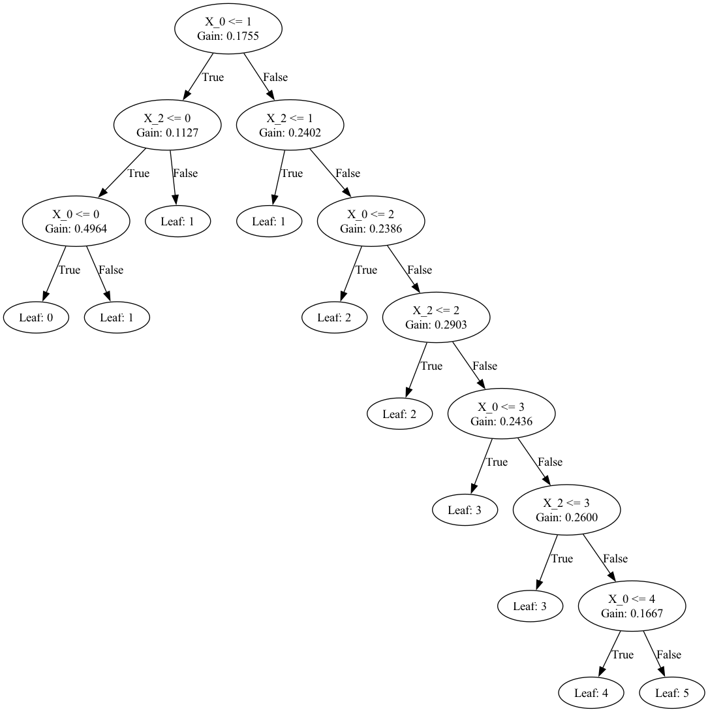

# 1. Gini Index

- Gini Index = Name of the _cost function_ used to evaluate splits in dataset.
- **Split** = 1 input attr. + 1 value for that attr.
- Perfect separation => Gini score of 0
- Worst case => 50/50 , Gini score of 0.5

## Calculating Gini Score

```
proportion = count(class_value) / count(rows)
```

```
gini_index = sum(proportion * (1.0 - proportion))
gini_index = 1.0 - sum(proportion * proportion)
```

- Gini index for each group must then be weighted by the size of the group, relative to all samples that are currently being grouped.

```
gini_index = (1.0 - sum(proportion * proportion)) * (group_size/total_samples)
```

---

# Decision Tree

## V1.

I used club_games.csv file to create my decision tree.
However, after cleaning data, it turns out we only have 4 meaningful features.

1. is_home
2. home_position
3. opponent_position
4. Goals - Opponents and clubs



It only uses Club goals and opponent goals data but this is not really useful.
Because we want to _predict_ the match, but goals are data we get post match...

ie: Even a 5 yr old can _predict_ the match result after he / she has a data about goals scored in the game

```python
Y_pred = classifier.predict(X_test)
from sklearn.metrics import accuracy_score
accuracy_score(Y_test, Y_pred)

> 0.4072
```

Also, our accuracy score is pretty low as well, and this is probably because we don't throughly did this...
